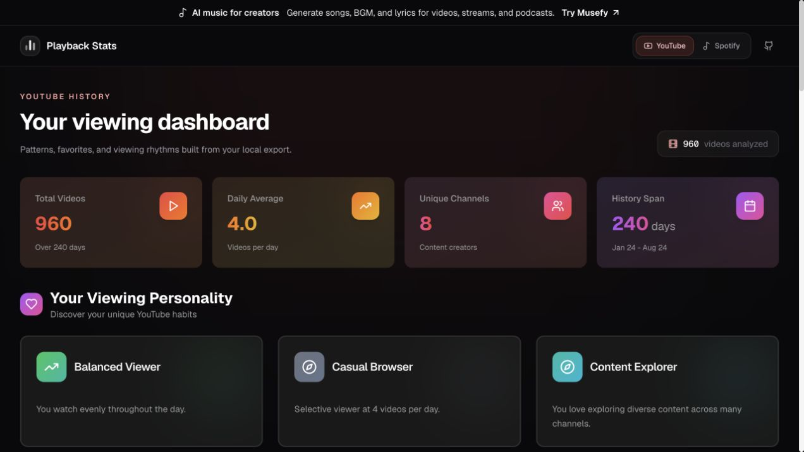
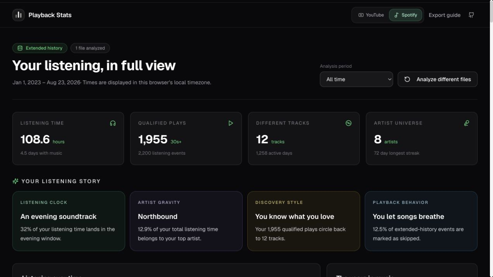

# Playback Stats

A privacy-first web app for exploring your YouTube watch history and Spotify listening history. Files are analyzed locally in your browser and are never uploaded.

[YouTube analyzer](https://playbackstats.com/) · [Spotify analyzer](https://playbackstats.com/spotify) · [GitHub](https://github.com/ronething/playbackstats)

## Features

- YouTube viewing trends, top channels, repeat videos, streaks, and habits
- Spotify listening time, top artists and tracks, trends, and playback behavior
- Google Takeout ZIP and watch-history.json support, plus Spotify streaming-history JSON
- Private, browser-only processing with no account connection or API key
- Localized YouTube analyzer pages and upload guidance in English, German, and French

## Preview

### YouTube



### Spotify



## Run locally

```bash
git clone https://github.com/ronething/playbackstats.git
cd playbackstats
pnpm install
pnpm dev
```

Open [http://localhost:3000](http://localhost:3000), then import a supported history export.

## Tech stack

Next.js, React, TypeScript, Tailwind CSS, and Recharts.
